# DayZ Command Line Launcher

Это экспериментальный лаунчер [DayZ][] (только [Steam][221100]) для Linux.

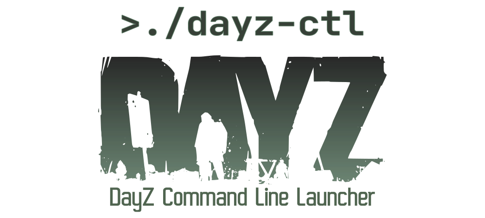

На момент реализации этого проекта [Bohemia Interactive][] всё еще не смогла сделать рабочий лаунчер для игры, который мог бы корректно устанавливать модификации и подключатся к игровым серверам. По этой причине появился этот проект.

Основные особенности:

* Обозреватель серверов с информацией о каждом сервере
* Нечеткий поиск в обозревателе серверов на базе [fzf][]
* Автоматическая установка модов (как опция)
* Широкий набор фильтров для поиска серверов (карта, время суток, модификации, количество игроков, от первого лица, пароль и т.п.)
* Дополнительная информация в виде страны расположения (используя geoip базу) и ping для каждого сервера
* Список избранного, история последних 10 игр и создание ярлыков быстрого запуска для подключения к серверам
* Оффлайн режим [DayZCommunityOfflineMode][] с автоматической установкой, обновлением и возможностью выбора модификаций
* Меню конфигурации с параметрами запуска игры, настройками лаунчера, управлением и статистикой по модам

<center>
<div style="text-align:center;width:80%">

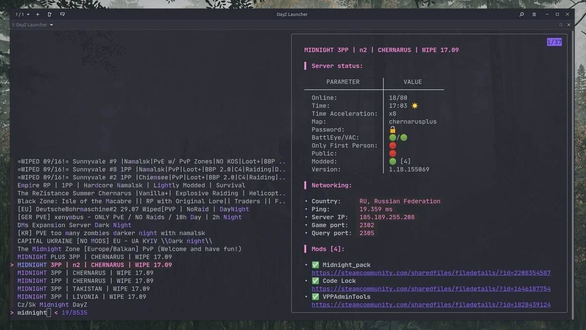

| 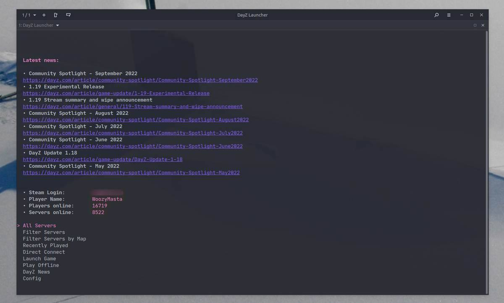 | 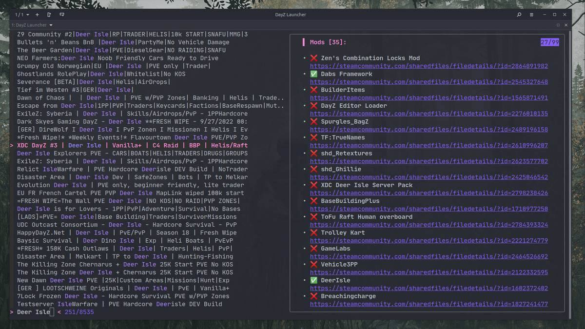  | 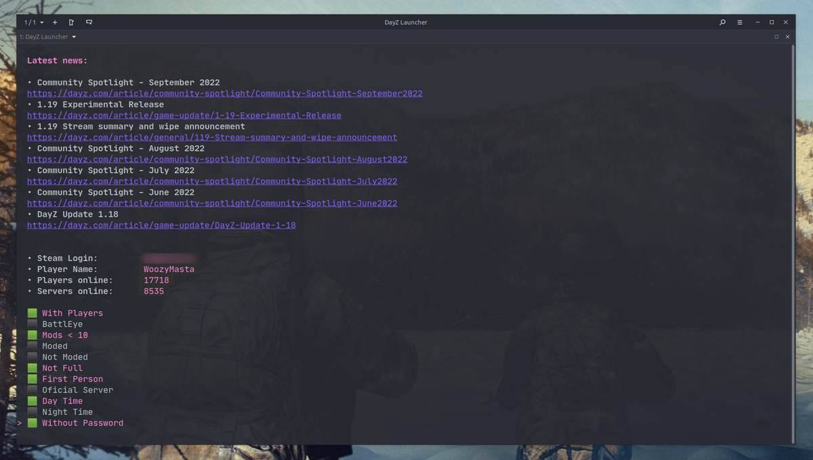  |
| ---------------- | ----------------- | ----------------- |
| 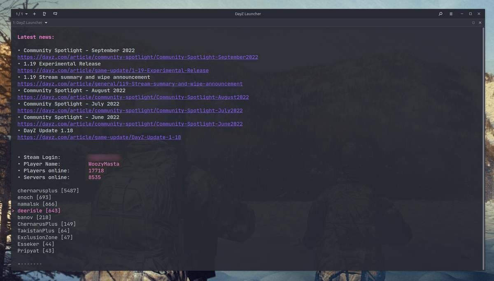 | 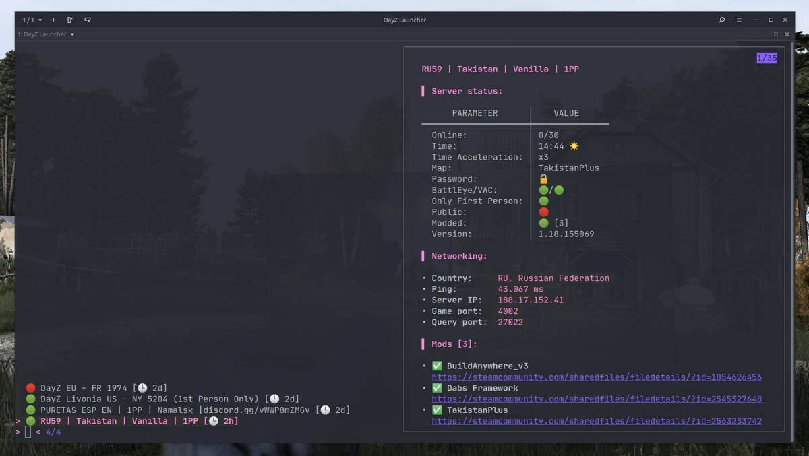  |  |
| 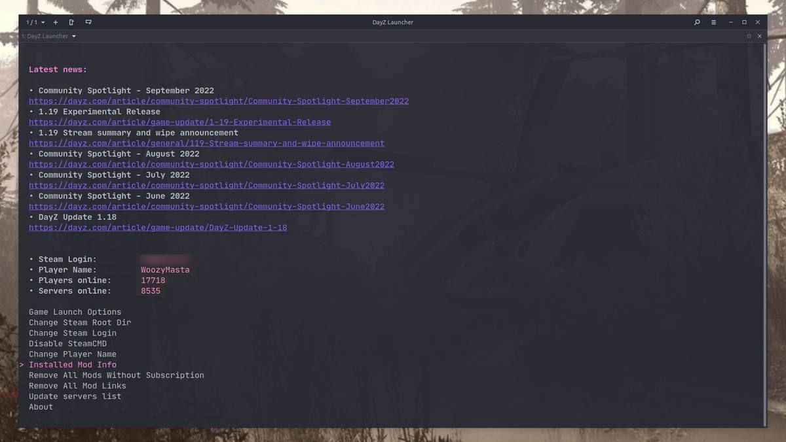 | 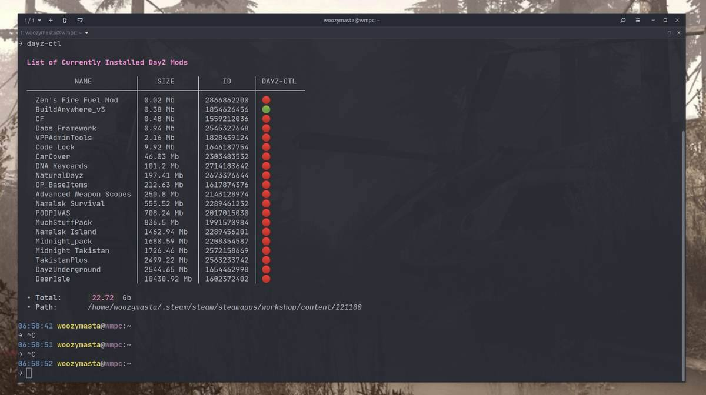  | 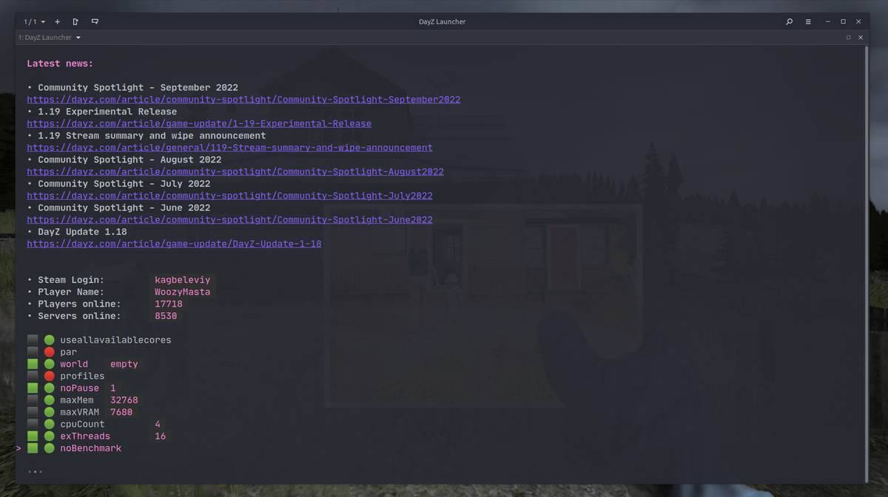 |
| 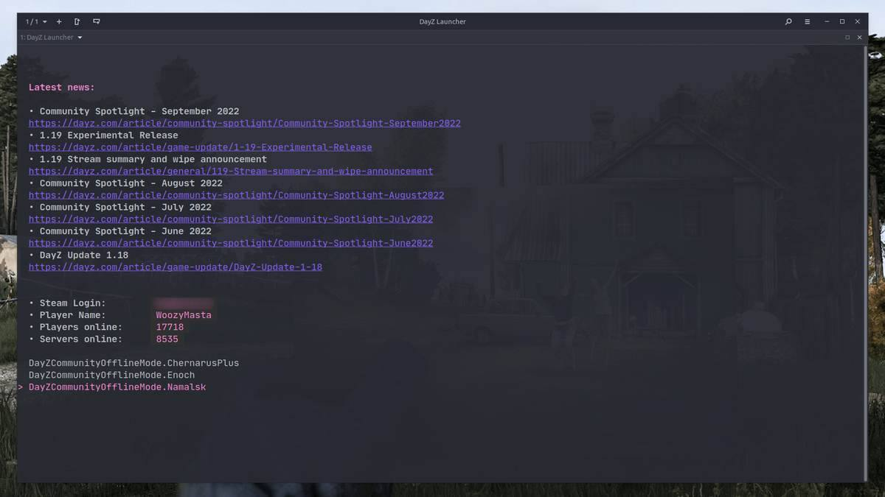 | 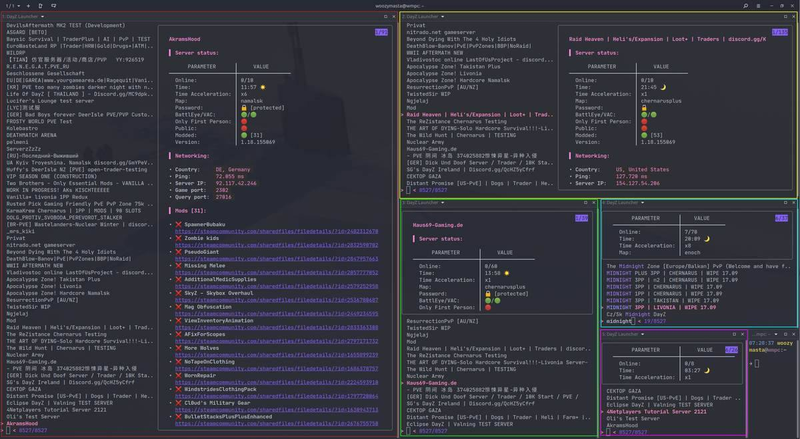 | 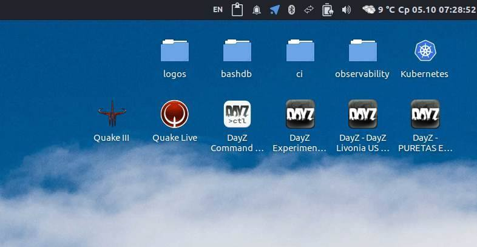 |
</div>
</center>

Отдельное спасибо [dayz-linux-cli-launcher][] за идею и [dayzsalauncher] за API.

## Особенности использования SteamCMD

### Используя steamcmd

* Не создается подписки на моды, они просто скачиваются
* Иногда нужно повторно авторизоваться в Steam
* Требует закрытия клиента Steam для загрузки модов
* Автоматическая проверка наличия обновлений модов
* Всё происходит автоматически

### Не используя steamcmd

* Подписываться на моды нужно самому руками
* Игра сама не запустится после скачивания модов
* Steam бывает задерживает проверку обновлений и скачивает их только после перезапуска или подписки/отписки от мода

## Установка

Для удобства установки имеется небольшой скрипт который сделает всё за вас (по крайней мере попытается сделать)

Выполните это:

```bash
curl -sSfL https://raw.githubusercontent.com/WoozyMasta/dayz-ctl/master/install | bash 
```

## Ручная установка

Для работы лаунчера вам необходимо убедится что у вас установлены все зависимости:

* [jq][] - утилита для обработки JSON
* [fzf][] - утилита для нечеткого поиска
* [gum][] - утилита для создания диалогов и стилизации вывода
* `ping` (`iputils-ping`) - узнаем пинг до сервера (где включен ICMP)
* `geoiplookup` (`geoip-bin`) - узнаем страну размещения сервера
* `whois` - запасной вариант для geoiplookup, менее точный и более медленный, но не все записи есть в стандартной БД geoip
* `curl` - утилита для комуникации с различными API по HTTP/S
* `cut, tr, grep, pgrep, pkill, killal, timeout, sed, awk` (`gawk`) - куда же без класических утилит в скриптах
* [Steam][] - онлайн-сервис цифрового распространения компьютерных игр
* [SteamCMD][] - steamcmd Консольный клиент Steam
* [DayZ][221100] - и естественно сама игра

После чего можете склонировать репозиторий:

```bash
git clone git@github.com:WoozyMasta/dayz-ctl.git
# or
git clone https://github.com/WoozyMasta/dayz-ctl.git
# and run
cd dayz-ctl
./dayz-ctl
```

Или скачать сам файл скрипта:

```bash
curl -sSfL -o ~/.local/bin/dayz-ctl \
  https://raw.githubusercontent.com/WoozyMasta/dayz-ctl/master/dayz-ctl
chmod +x ~/.local/bin/dayz-ctl
# and run
dayz-ctl
```

<!-- Links -->
[DayZ]: https://dayz.com
[Bohemia Interactive]: https://www.bohemia.net/games/dayz
[221100]: https://store.steampowered.com/app/221100
[dayz-linux-cli-launcher]: https://github.com/bastimeyer/dayz-linux-cli-launcher
[dayzsalauncher]: https://dayzsalauncher.com
[battlemetrics]: https://www.battlemetrics.com
[SteamCMD]: https://developer.valvesoftware.com/wiki/SteamCMD
[fzf]: https://github.com/junegunn/fzf
[jq]: https://github.com/stedolan/jq
[gum]: https://github.com/charmbracelet/gum
[DayZCommunityOfflineMode]: https://github.com/Arkensor/DayZCommunityOfflineMode
[Steam]: https://store.steampowered.com/about/
