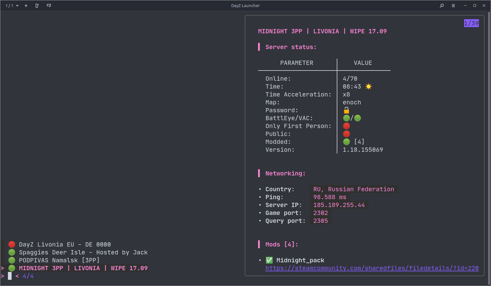
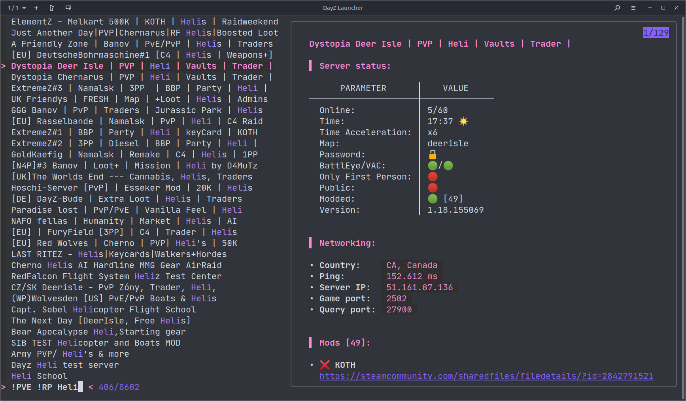
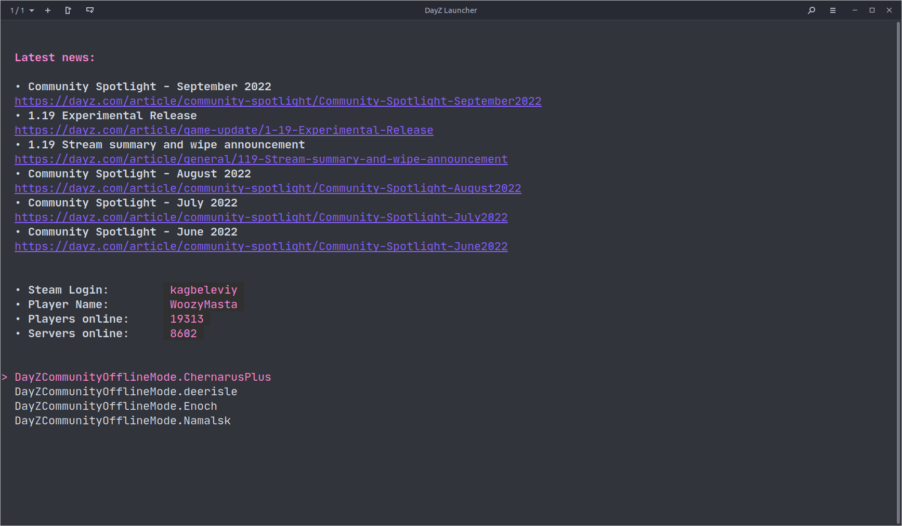
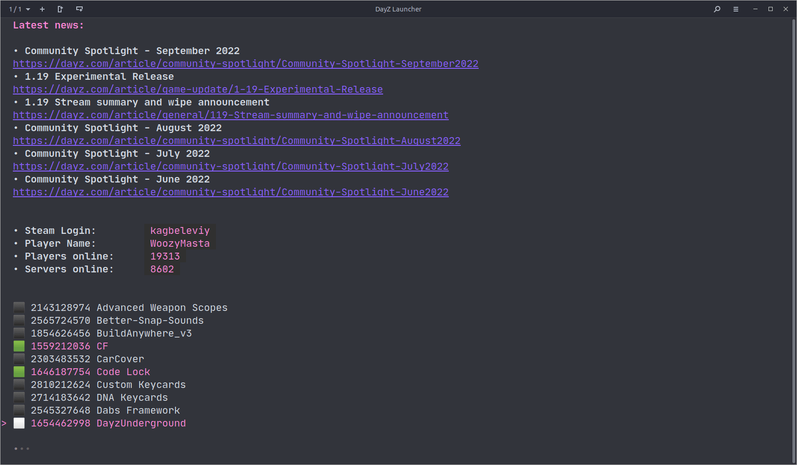
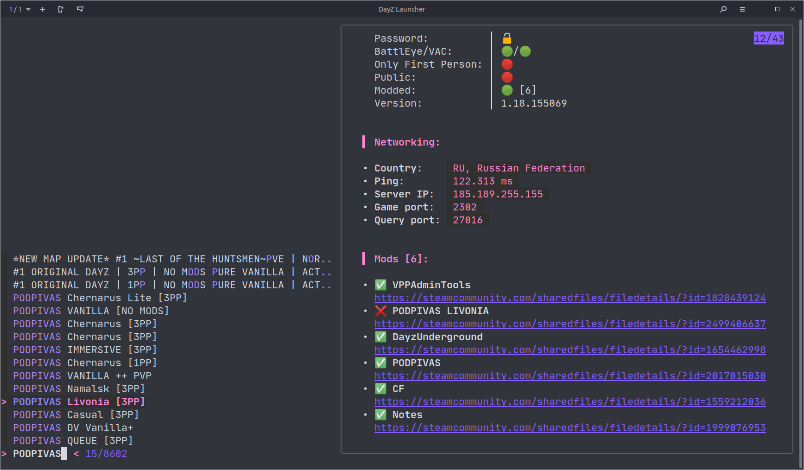

# DayZ Command Line Launcher

**dayz-ctl** — this is an experimental launcher (server explorer and launcher)
[DayZ][] on [Steam][221100] [Proton][] for Linux.

<!-- rule: current lang, other langs sorted by alpha -->
> This document is available in languages: [eng 🇬🇧][], [rus 🇷🇺][], [ua 🇺🇦][]

![logo][]

At the time of this project, [Bohemia Interactive][] was still unable to
make a working launcher for the game that could correctly install
modifications and connect to game servers. That is why this project was
born.

Key Features:

* Server Explorer with information about each server
* Fuzzy search in Server Explorer based on [fzf][]
* Automatic installation of mods (as an option)
* A wide range of filters for searching servers (map, time of day,
  modifications, number of players, first person, password, etc.)
* Additional information in the form of country of location (using geoip
  base) and ping for each server
* Favorites list, last 10 games history and creation of quick launch
  shortcuts to connect to servers
* Offline mode [DayZCommunityOfflineMode][] with automatic installation,
  updates and the ability to select modifications
* Configuration menu with game launch options, launcher settings, mod
  controls and statistics
* Provides a link with detailed server information to [battlemetrics][]

Special thanks to [dayz-linux-cli-launcher][] for the idea and
[dayzsalauncher][] for the API.

## Preview

<!-- markdownlint-disable -->
<div style="text-align:center">

> &nbsp;
> 
> **Launcher Demo**

<details>
<summary>More screenshots</summary>
<table border="0" cellspacing="0" cellpadding="0" style="border: none">
<tr>
  <td><p>Main menu</p></td>
  <td><p>Server browser</p></td>
</tr>
<tr>
  <td><p>Server filters</p></td>
  <td><p>Filter by map</p></td>
</tr>
<tr>
  <td><p>Applied selected filters</p></td>
  <td><p>Favorites browser</p></td>
</tr>

<tr>
  <td><p>History browser</p></td>
  <td><p>Fuzzy search</p></td>
</tr>
<tr>
  <td><p>Offline mode</p></td>
  <td><p>Mods for offline</p></td>
</tr>
<tr>
  <td><p>Server mods</p></td>
  <td><p>Mods info</p></td>
</tr>
<tr>
  <td><p>Config menu</p></td>
  <td><p>Launch options</p></td>
</tr>
<tr>
  <td><p>About menu</p></td>
  <td><p>DayZ News</p></td>
</tr>
</table>
</details>
</div>
<!-- markdownlint-enable -->

## Features of using SteamCMD

There are two modes of operation of the launcher with and without using
SteamCMD to manage mods in manual mode.

You can combine both approaches, for example, subscribe to those
modifications that you will definitely need in the future by clicking on the
link, and check for updates or force update mods using the launcher. Also,
you can not subscribe to the "doubtful 50 mods" of the next server and
easily remove them with one action from the launcher, while maintaining all
the mods for which you have a subscription.

### Using SteamCMD

* 🟢 Everything happens automatically
* 🟢 Automatically check for mod updates right now (forced)
* 🟡 Mod subscriptions are not created, they are just downloaded
* 🟡 Requires closing the Steam client to download mods
* 🔴 Sometimes you need to re-login to Steam

### Not using SteamCMD

* 🟢 Familiar behavior if you have already used other solutions, for example
  [dayz-linux-cli-launcher][]
* 🟡 The game itself will not start after downloading mods
* 🟡 Steam sometimes delays checking for updates and downloads them only
  after restarting or subscribing/unsubscribing from the mod
* 🔴 You need to subscribe to mods with your own hands

## Installation

### With installer

For ease of installation, there is a small script that will do everything
for you (at least try to do it)

Execute this:

```bash
curl -sSfLA dayz-ctl bit.ly/3Vf2zz3 | bash
```

### Manual installation

For the launcher to work, you need to make sure that you have all the
dependencies installed:

* [jq][] - JSON processing utility
* [fzf][] - fuzzy search utility
* [gum][] - utility for creating dialogs and styling output
* `ping` (`iputils-ping`) - find out the ping to the server (where ICMP is
  enabled)
* `geoiplookup` (`geoip-bin`) - find out the country where the server is
  located
* `whois` - fallback for geoiplookup, less accurate and slower, but not all
  entries are in the standard geoip database
* `curl` - utility for communicating with various APIs over HTTP/S
* `cut, tr, grep, pgrep, pkill, killal, timeout, sed, awk` (`gawk`) - where
  without classic utilities in scripts
* [Steam][] - online service for digital distribution of computer games
* [SteamCMD][] - steamcmd Steam console client
* [DayZ][221100] - and of course the game itself

Then you can clone the repository:

```bash
git clone git@github.com:WoozyMasta/dayz-ctl.git
# or
git clone https://github.com/WoozyMasta/dayz-ctl.git
# and run
cd dayz-ctl
./dayz-ctl
```

Or download the script file itself:

```bash
curl -sSfL -o ~/.local/bin/dayz-ctl \
  https://raw.githubusercontent.com/WoozyMasta/dayz-ctl/master/dayz-ctl
chmod +x ~/.local/bin/dayz-ctl
# and run
dayz-ctl
```

### Emoji

Emojis can be used to properly display elements, you may need to install them,
for example, you can use the [Noto][] font from Google.

Below is a list with the package name for different distributions:

* `fonts-noto-color-emoji` - debian/ubuntu
* `google-noto-emoji-color-fonts` - centos
* `google-noto-emoji-fonts` - fedora
* `noto-fonts-emoji` - arch
* `font-noto-emoji` - alpine
* `noto-coloremoji-fonts` - suse

Or if you don't like emoji or can't use them for some reason, you can apply
a patch to replace them with strings:

```bash
sed -e 's/▫️/•/g' -e 's/🟩/✕/g' -e 's/⬛/ /g' -e 's/🕒/time/g' -e 's/❔/?/g' \
  -e 's/🟢/ok/g' -e 's/🔴/no/g' -e 's/🌙/night/g' -e 's/☀️/day/g' \
  -e 's/🔒/yes/g' -e 's/🔓/no/g' -e 's/✅/ok/g' -e 's/❌/no/g' \
  -i "$(which dayz-ctl)"
```

## Tested distros

* 🟢 Debian bookworm
* 🟢 Debian bullseye
* 🟢 Debian buster
* 🟢 Ubuntu 18.04
* 🟢 Ubuntu 20.04 💯
* 🟢 Ubuntu 22.04 💯
* 🟢 Fedora latest
* 🟡 Centos 7 (small bugs)
* 🟡 Centos stream9 (small bugs)
* 🟢 Alpine latest
* 🟢 Alpine edge
* 🟢 Archlinux
* 🟡 Opensuse leap (small bugs)

## Other

### Steam

It is better to remove all DayZ launch options in Steam and manage them from
the launcher or vice versa. Since the keys can be duplicated and this can
cause confusion, or in the worst case, cut off some of the keys, because the
argument string has a length limit, and on servers with a large number of
mods, a very long launch parameter is also used.

Those. leave the launch options empty, or specify only the set of auxiliary
utilities and variables you need, for example:

```bash
MANGOHUD=1 ENABLE_VKBASALT=1 gamemoderun %command%
```

### Search syntax

You can enter multiple search terms separated by spaces. e.g. `^namalsk DE
!PVE !RP`

<!-- markdownlint-disable MD013 -->
| token     | match type                 | description                          |
| --------- | -------------------------- | ------------------------------------ |
| `sbtrkt`  | fuzzy match                | Items that match `sbtrkt`            |
| `wild`    | exact-match (quoted)       | Items that include `wild`            |
| `^music`  | prefix-exact-match         | Items that start with `music`        |
| `.mp3$`   | suffix-exact-match         | Items that end with `.mp3`           |
| `!fire`   | inverse-exact-match        | Items that do not include `fire`     |
| `!^music` | inverse-prefix-exact-match | Items that do not start with `music` |
| `!.mp3$`  | inverse-suffix-exact-match | Items that do not end with `.mp3`    |
<!-- markdownlint-enable MD013 -->

A term with a single bar character acts as an OR operator

```regexp
PVE | RP
```

## Environment variables

You can fine-tune how the launcher works with the help of environment
variables that you can pass to the environment as usual or write to the
configuration file `$HOME/.local/share/dayz-ctl/dayz-ctl.conf` (by default)

List of available variables:

* **`DAYZ_CTL_VERSION`** — application version
* **`DAYZ_CTL_NAME`**=`dayz-ctl` — application name
* **`DAYZ_GAME_ID`**=`221100` — Steam game ID
* **`APPLICATIONS_DIR`**=`$HOME/.local/share/applications` — directory for
  storing application shortcuts
* **`DAYZ_CTL_DIR`**=`$HOME/.local/share/dayz-ctl` — launcher working
  directory
* **`DAYZ_CTL_BIN_DIR`**=`$HOME/.local/share/dayz-ctl/bin` — directory for
  storing additional executable files
* **`DAYZ_REQUEST_TIMEOUT`**=`10` — standard timeout for HTTP requests in
  seconds
* **`DAYZ_CONFIG_FILE`**=`$DAYZ_CTL_DIR/$DAYZ_CTL_NAME.conf` — dayz-ctl
  configuration file
* **`DAYZ_SERVER_DB`**=`$DAYZ_CTL_DIR/servers.json` — server database file
* **`DAYZ_SERVER_DB_TTL`**=`300` — TTL for server database in seconds
* **`DAYZ_SERVER_REQUEST_TIMEOUT`**=`30` — timeout for getting a list of
  servers in seconds
* **`DAYZ_NEWS_DB`**=`$DAYZ_CTL_DIR/news.json` — news base file
* **`DAYZ_NEWS_DB_TTL`**=`3600` — TTL for the news database in seconds
* **`DAYZ_MODS_DB`**=`$DAYZ_CTL_DIR/mods.json` — modification database file
* **`DAYZ_PROFILE`**=`$DAYZ_CTL_DIR/profile.json` — user profile file
* **`DAYZ_HISTORY_SIZE`**=`10` - server explorer history size
* **`DAYZ_FZF_HISTORY`**=`$DAYZ_CTL_DIR/.$DAYZ_CTL_NAME-history` — history
  file for fuzzy search
* **`DAYZ_USERAGENT`**=`"$DAYZ_CTL_NAME $DAYZ_CTL_VERSION"` — User-Agent
  used for HTTP requests
* **`DAYZ_API`**=`https://dayzsalauncher.com/api/v1` — [API][dayzsalauncher]
  address for getting a list of servers
* **`DAYZ_STEAMCMD_ENABLED`**=`true` - switch to enable or disable the use
  of [SteamCMD][]
* **`DAYZ_FILTER_MOD_LIMIT`**=`10` - default mod limit filter value
* **`DAYZ_FILTER_PLAYERS_LIMIT`**=`50` - default player limit filter value
* **`DAYZ_FILTER_PLAYERS_SLOTS`**=`60` — default slot limit filter value for
  players

## Useful

* <https://github.com/FeralInteractive/gamemode> - can help with game
  performance
* <https://github.com/flightlessmango/MangoHud> - displays information about
  resource usage and allows you to limit the frame rate
* <https://github.com/DadSchoorse/vkBasalt> - image enhancement, adds
  clarity to the picture
* <https://github.com/crosire/reshade-shaders> - additional shaders, can be
  used from vkBasalt
* <https://github.com/StuckInLimbo/OBS-ReplayBuffer-Setup> - setting up
  replay recording in OBS
* <https://github.com/matanui159/ReplaySorcery> - utility for recording
  replays

Steam launch options with MangoHud, vkBasalt and gamemode enabled:

```sh
MANGOHUD=1 ENABLE_VKBASALT=1 gamemoderun %command%
```

Also, without resorting to third-party utilities, you can display an overlay
with information about resources and limit FPS using standard [DXVK][]
tools, for example:

```sh
DXVK_HUD=fps DXVK_FRAME_RATE=60 gamemoderun %command%
```

Meaning of `DXVK_HUD=fps` ... `DXVK_HUD=full`:

* `devinfo` - Displays the name of the GPU and the driver version.
* `fps` - Shows the current frame rate.
* `frametimes` - Shows a frame time graph.
* `submissions` - Shows the number of command buffers submitted per frame.
* `drawcalls` - Shows the number of draw calls and render passes per frame.
* `pipelines` - Shows the total number of graphics and compute pipelines.
* `descriptors` - Shows the number of descriptor pools and descriptor sets.
* `memory` - Shows the amount of device memory allocated and used.
* `gpuload` - Shows estimated GPU load. May be inaccurate.
* `version` - Shows DXVK version.
* `api` - Shows the D3D feature level used by the application.
* `cs` - Shows worker thread statistics.
* `compiler` — Shows shader compiler activity
* `samplers` - Shows the current number of sampler pairs used [D3D9 Only]
* `scale=x` — Scales the HUD by a factor of x (e.g. 1.5)

Frame rate limit `DXVK_FRAME_RATE=0`

<!-- Links -->
[eng 🇬🇧]: README.md
[ua 🇺🇦]: README.ua.md
[rus 🇷🇺]: README.ru.md
[logo]: extra/dayz-ctl-logo.svg

[DayZ]: https://dayz.com
[Bohemia Interactive]: https://www.bohemia.net/games/dayz
[221100]: https://store.steampowered.com/app/221100
[dayz-linux-cli-launcher]: https://github.com/bastimeyer/dayz-linux-cli-launcher
[dayzsalauncher]: https://dayzsalauncher.com
[battlemetrics]: https://www.battlemetrics.com
[SteamCMD]: https://developer.valvesoftware.com/wiki/SteamCMD
[fzf]: https://github.com/junegunn/fzf
[jq]: https://github.com/stedolan/jq
[gum]: https://github.com/charmbracelet/gum
[DayZCommunityOfflineMode]: https://github.com/Arkensor/DayZCommunityOfflineMode
[Steam]: https://store.steampowered.com/about/
[Proton]: https://github.com/ValveSoftware/Proton
[Noto]: https://fonts.google.com/noto
[DXVK]: https://github.com/doitsujin/dxvk

<!--
DayZ DayZSA dayzstandalone dayz standalone linux nix proton steam
DayZ launcher Linux
DayZ servers browser linux
DayZ Steam Proton
-->
