# DayZ Command Line Launcher

Це експериментальний лаунчер (браузер серверів і засіб запуску) [DayZ][] в
[Steam][221100] [Proton][] для Linux.

> Цей документ доступний у мовах: [eng 🇬🇧][], [ua 🇺🇦][], [rus 🇷🇺][]

![logo][]

На момент реалізації цього проекту [Bohemia Interactive][] все ще не змогла
зробити робочий лаунчер для гри, який міг би коректно встановлювати
модифікації та підключаться до ігрових серверів. З цієї причини виник цей
проект.

Основні особливості:

* Оглядач серверів з інформацією про кожен сервер
* Нечіткий пошук в браузері серверів на базі [fzf][]
* Автоматична установка модів (як опція)
* Широкий набір фільтрів для пошуку серверів (карта, час доби, модифікації,
  кількість гравців, від першої особи, пароль тощо)
* Додаткова інформація у вигляді країни розташування (використовуючи geoip
  базу) та ping для кожного сервера
* Список обраного, історія останніх 10 ігор та створення ярликів швидкого
  запуску для підключення до серверів
* Оффлайн режим [DayZCommunityOfflineMode][] з автоматичною установкою,
  оновленням та можливістю вибору модифікацій
* Меню конфігурації з параметрами запуску гри, налаштуваннями лаунчера,
  керуванням та статистикою за модами
* Надає посилання з детальною інформацією про сервер на [battlemetrics][]

## Preview

<!-- markdownlint-disable -->
<div style="text-align:center">

> &nbsp;
> 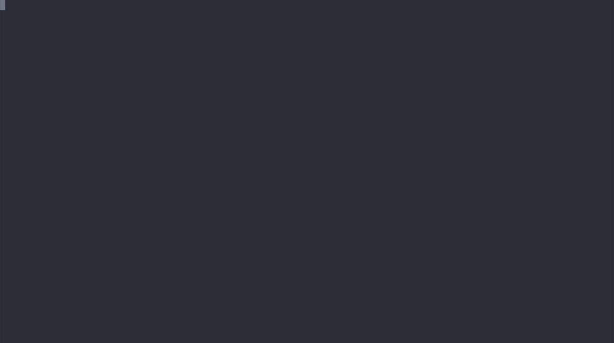
> **Launcher Demo**

<details>
<summary>Больше скриншотов</summary>
<table border="0" cellspacing="0" cellpadding="0" style="border: none">
<tr>
  <td>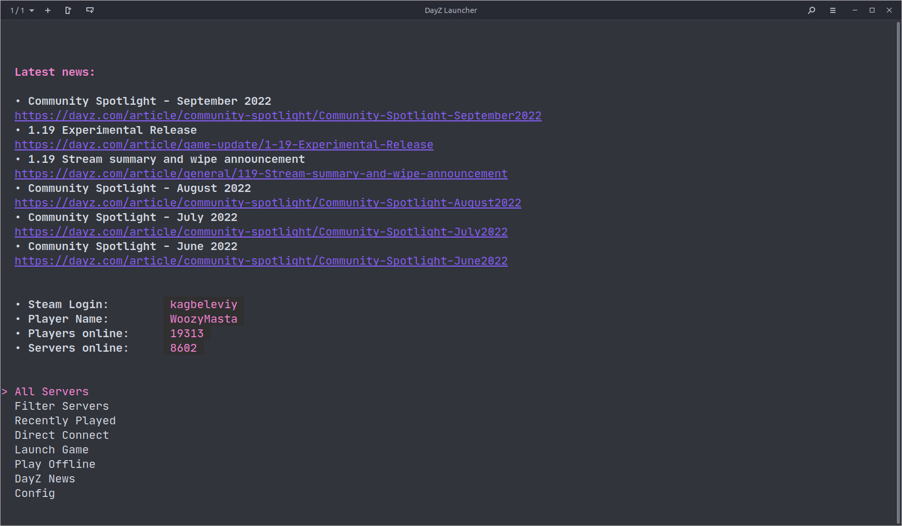<p>Главное меню</p></td>
  <td>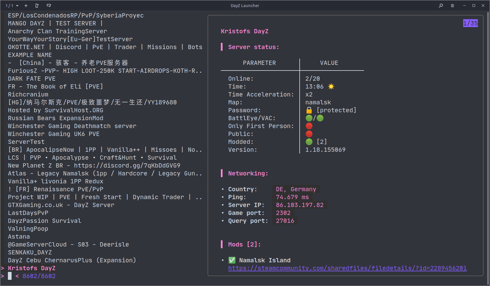<p>Браузер серверов</p></td>
</tr>
<tr>
  <td>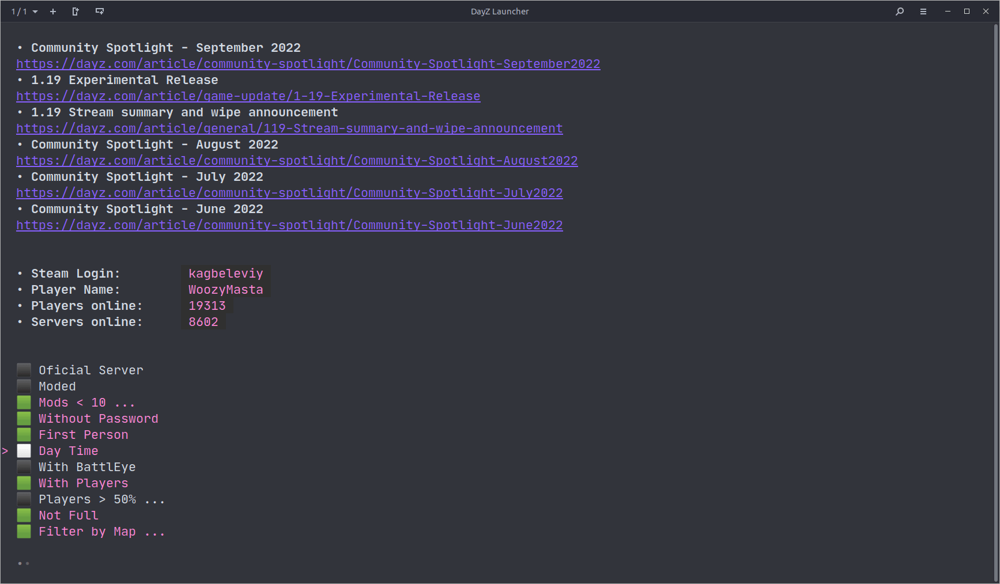<p>Фильтрация серверов</p></td>
  <td>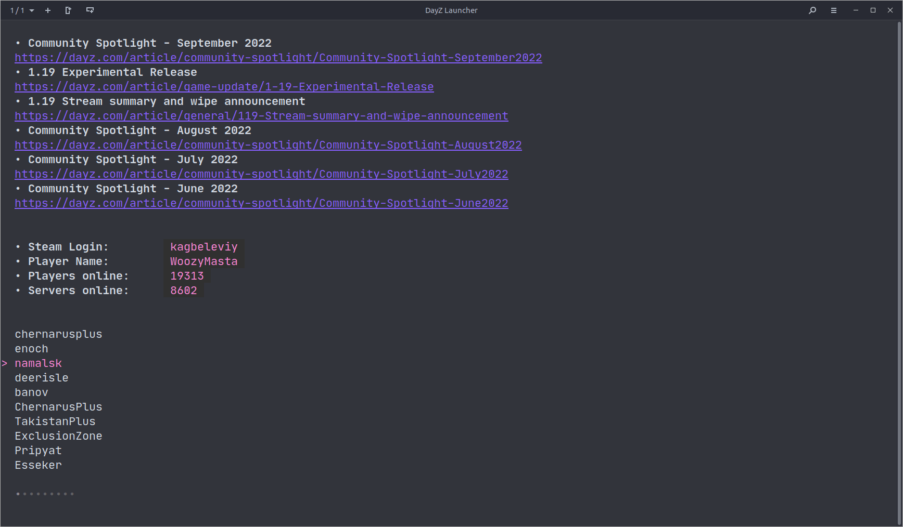<p>Фильтрация по карте</p></td>
</tr>
<tr>
  <td>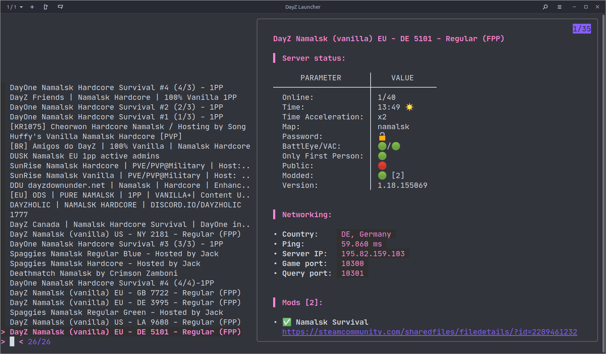<p>Применение фильтра</p></td>
  <td>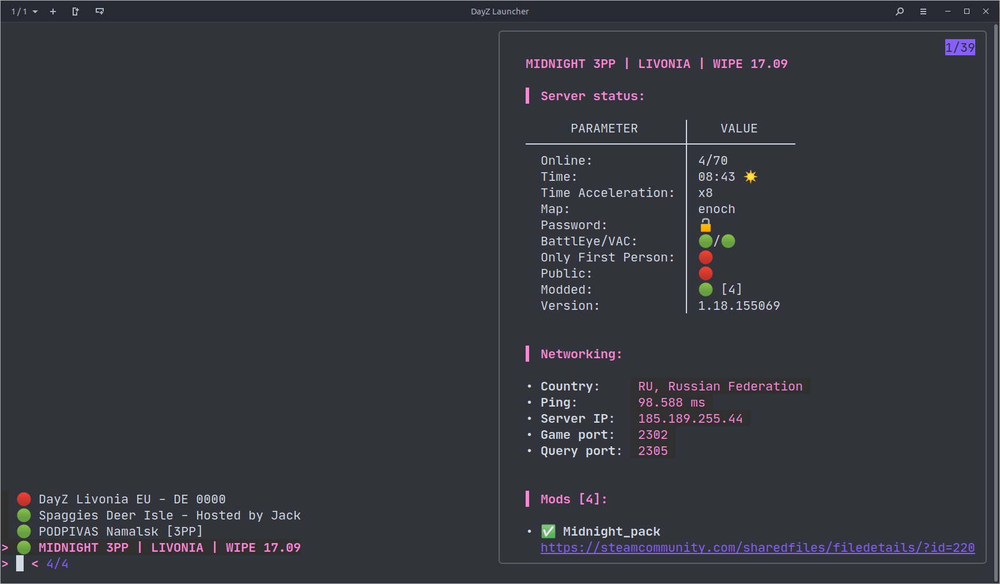<p>Браузер избранного</p></td>
</tr>

<tr>
  <td>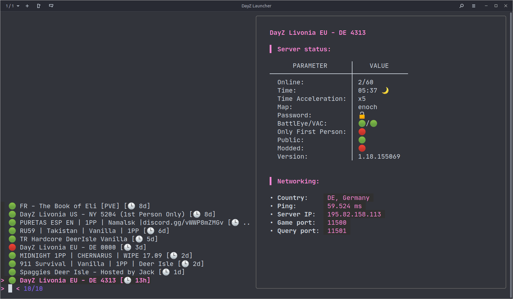<p>Браузер истории</p></td>
  <td>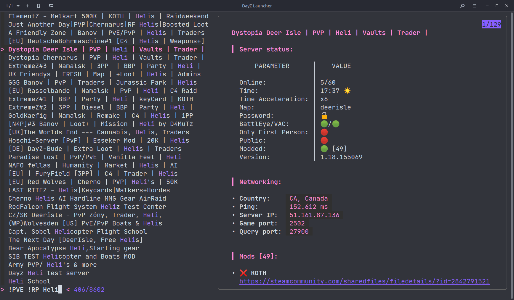<p>Нечеткий поиск</p></td>
</tr>
<tr>
  <td>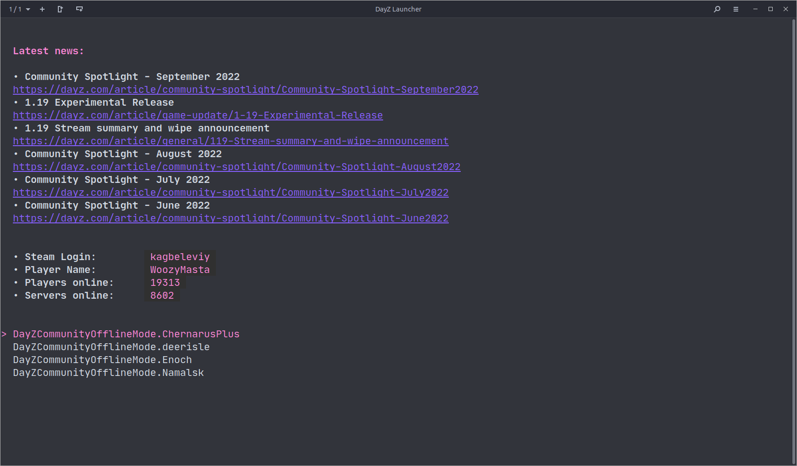<p>Оффлайн режим</p></td>
  <td>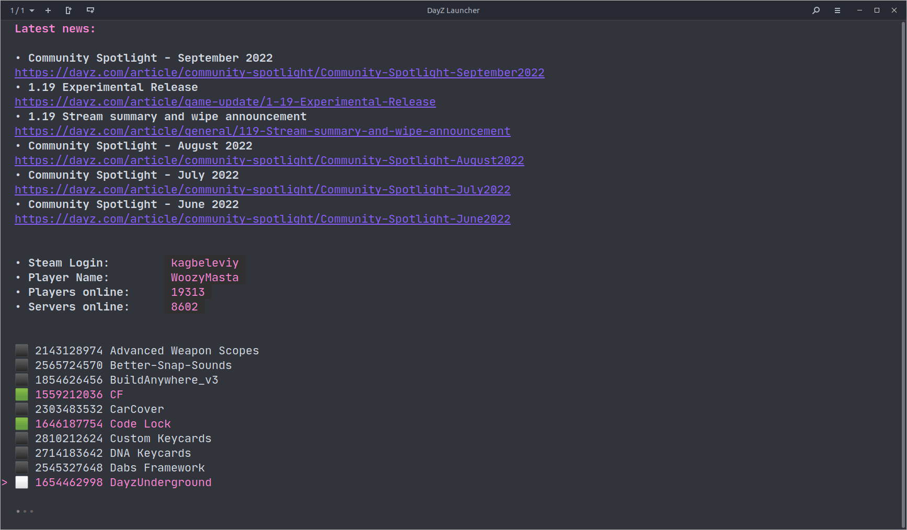<p>Моды для оффлайн</p></td>
</tr>
<tr>
  <td>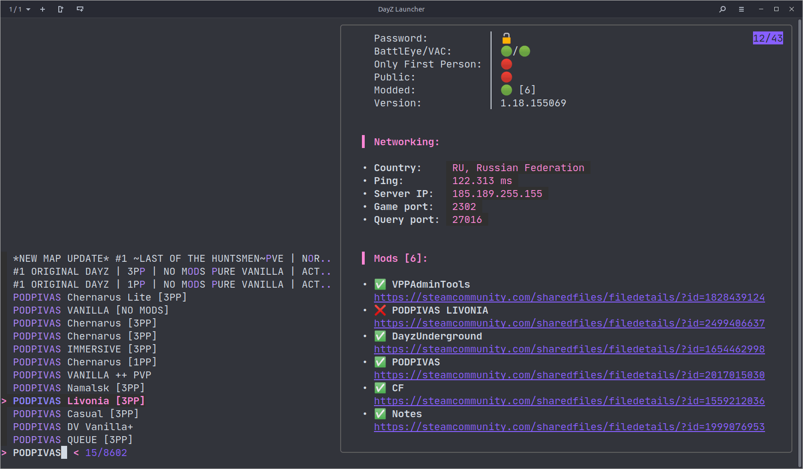<p>Моды сервера</p></td>
  <td>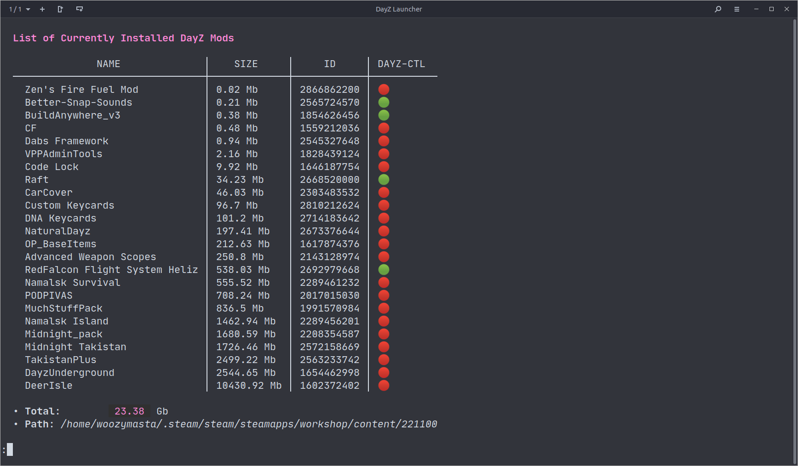<p>Информация о модах</p></td>
</tr>
<tr>
  <td>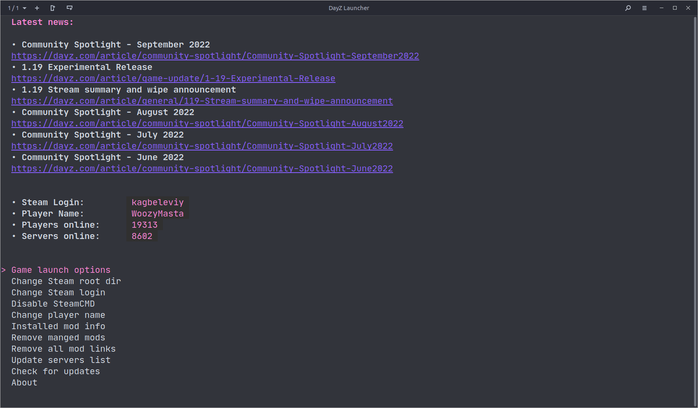<p>Меню конфигурации</p></td>
  <td>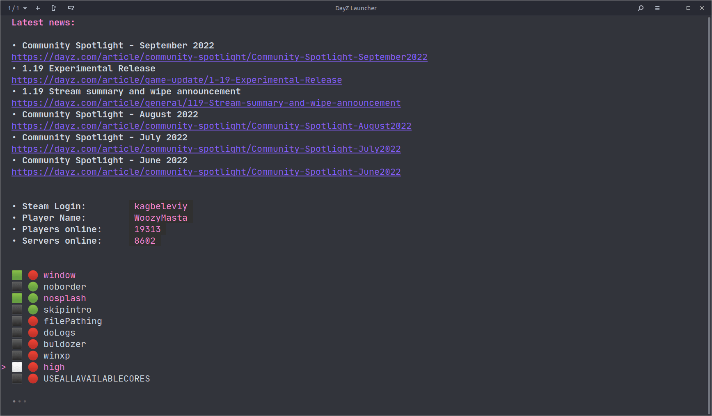<p>Параметры запуска</p></td>
</tr>
<tr>
  <td>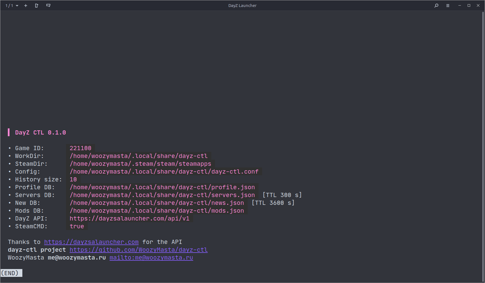<p>Информация</p></td>
  <td>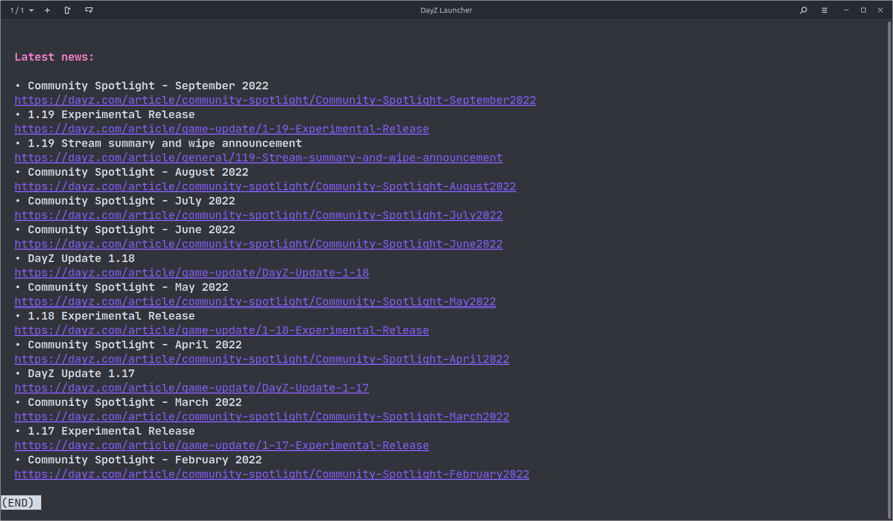<p>Новости DayZ</p></td>
</tr>
</table>
</details>
</div>
<!-- markdownlint-enable -->

Окреме спасибі [dayz-linux-cli-launcher][] за ідею та [dayzsalauncher][] за
API.

## Особливості використання SteamCMD

Є два режими роботи лаунчера з використанням SteamCMD для керування модами
та без нього в ручному режимі.

Ви можете комбінувати обидва підходи, наприклад підписуватися на ті
модифікації, які вам точно потрібні будуть у майбутньому, переходячи за
посиланням, а наявність оновлень перевіряти або примусово оновлювати моди за
допомогою лаунчера. Також ви можете не підписуватися на "сумнівні 50 модів"
чергового сервера і легко видалити їх однією дією з лаунчера, при цьому
зберігши всі моди на які є підписка.

### Використовуючи SteamCMD

* 🟢 Все відбувається автоматично
* 🟢 Автоматична перевірка наявності оновлень модів прямо зараз (примусово)
* 🟡 Не створюється підписки на моди, вони просто скачуються
* 🟡 Вимагає закриття клієнта Steam для завантаження модів
* 🔴 Іноді потрібно повторно авторизуватися в Steam

### Не використовуючи SteamCMD

* 🟢 Звична поведінка якщо ви вже використовували інші рішення, наприклад
  [dayz-linux-cli-launcher][]
* 🟡 Гра сама не запуститься після завантаження модів
* 🟡 Steam буває затримує перевірку оновлень і скачує їх тільки після
  перезапуску або підписки/відписки від мода
* 🔴 Передплатити моди потрібно самому руками

## Встановлення

### За допомогою установника

Для зручності установки є невеликий скрипт, який зробить все за вас
(принаймні спробує зробити)

Виконайте це:

``` bash
curl -sSfL https://raw.githubusercontent.com/WoozyMasta/dayz-ctl/master/install | bash
```

## Ручна установка

Для роботи лаунчера вам необхідно переконатися, що у вас встановлені всі
залежності:

* [jq][] - утиліта для обробки JSON
* [fzf][] - утиліта для нечіткого пошуку
* [gum][] - утиліта для створення діалогів та стилізації висновку
* `ping` (`iputils-ping`) - дізнаємось пінг до сервера (де включений ICMP)
* `geoiplookup` (`geoip-bin`) - дізнаємось країну розміщення сервера
* `whois` - запасний варіант для geoiplookup, менш точний і повільніший, але
  не всі записи є в стандартній БД geoip
* `curl` - утиліта для комунікації з різними API з HTTP/S
* `cut, tr, grep, pgrep, pkill, killal, timeout, sed, awk` (`gawk`) - куди ж
  без класичних утиліт у скриптах
* [Steam][] - онлайн-сервіс цифрового розповсюдження комп'ютерних ігор
* [SteamCMD][] - steamcmd Консольний клієнт Steam
* [DayZ][221100] - і природно сама гра

Після цього можете схилювати репозиторій:

``` bash
git clone git@github.com:WoozyMasta/dayz-ctl.git
# or
git clone https://github.com/WoozyMasta/dayz-ctl.git
# and run
cd dayz-ctl
./dayz-ctl
```

Або завантажити сам файл скрипту:

``` bash
curl -sSfL -o ~/.local/bin/dayz-ctl \
  https://raw.githubusercontent.com/WoozyMasta/dayz-ctl/master/dayz-ctl
chmod +x ~/.local/bin/dayz-ctl
# and run
dayz-ctl
```

### Emoji

Для нормального відображення елементів використовуються emoji, можливо
додатково вам знадобиться встановити їх, наприклад, ви можете
використовувати [Noto][] шрифт від Google.

Нижче наведено список із назвою пакета для різних дистрибутивів:

* `fonts-noto-color-emoji` - debian/ubuntu
* `google-noto-emoji-color-fonts` - centos
* `google-noto-emoji-fonts` - fedora
* `noto-fonts-emoji` - arch
* `font-noto-emoji` - alpine
* `noto-coloremoji-fonts` - suse

Або якщо вам не подобаються emoji або ви не можете використовувати їх з
якоїсь причини, ви можете застосувати патч для заміни їх на рядки:

```bash
sed -e 's/▫️/•/g' -e 's/🟩/✕/g' -e 's/⬛/ /g' -e 's/🕒/time/g' -e 's/❔/?/g' \
  -e 's/🟢/ok/g' -e 's/🔴/no/g' -e 's/🌙/night/g' -e 's/☀️/day/g' \
  -e 's/🔒/yes/g' -e 's/🔓/no/g' -e 's/✅/ok/g' -e 's/❌/no/g' \
  -i "$(which dayz-ctl)"
```

## Перевірялося у дистрибутивах

* 🟢 Debian bookworm
* 🟢 Debian bullseye
* 🟢 Debian buster
* 🟢 Ubuntu 18.04
* 🟢 Ubuntu 20.04
* 🟢 Ubuntu 22.04
* 🟢 Fedora latest
* 🟡 Centos 7 (small bugs)
* 🟡 Centos stream9 (small bugs)
* 🟢 Alpine latest
* 🟢 Alpine edge
* 🟢 Archlinux
* 🟡 Opensuse leap (small bugs)

## Інше

### Steam

Краще прибирати всі параметри запуску DayZ у Steam та керувати ними з
лаунчера чи навпаки. Так як ключі можуть дублюватися і це може викликати
плутанину, або в гіршому випадку обріже частину ключів, адже рядок
аргументів має ліміт довжини, а на серверах з великою кількістю модів
використовується і так дуже довгий параметр запуску.

Тобто. залиште параметри запуску порожніми, або вкажіть лише потрібний вам
набір допоміжних утиліт та змінних, наприклад:

``` bash
MANGOHUD=1 ENABLE_VKBASALT=1 gamemoderun %command%
```

### Синтаксис пошуку

Ви можете ввести кілька умов пошуку, розділених пробілами. наприклад
`^namalsk DE !PVE !RP`

| Ключ      | Тип відповідності Опис                  |                                        |
| --------- | --------------------------------------- | -------------------------------------- |
| `sbtrkt`  | нечіткий збіг                           | Елементи, що відповідають `sbtrkt`     |
| `wild`    | точне співпадання (у лапках)            | Елементи, що включають `wild`          |
| `^music`  | точне співпадання префікса              | Елементи, що починаються з `music`     |
| `.mp3$`   | суфікс-точний збіг                      | Елементи, що закінчуються на `.mp3`    |
| `!fire`   | зворотне точне збіг                     | Предмети, які не містять слова `fire`  |
| `!^music` | точну відповідність зворотного префікса | Елементи, які не починаються з `music` |
| `!.mp3$`  | точне відповідність зворотного суфікса  | Елементи, що не закінчуються на `.mp3` |

Термін з одним символом риси діє як оператор АБО

```regexp
PVE | RP
```

## Корисне

* <https://github.com/FeralInteractive/gamemode>
* <https://github.com/flightlessmango/MangoHud>
* <https://github.com/DadSchoorse/vkBasalt>
* <https://github.com/crosire/reshade-shaders>
* <https://github.com/StuckInLimbo/OBS-ReplayBuffer-Setup>
* <https://github.com/matanui159/ReplaySorcery>
* <https://github.com/LunarG/VulkanTools/blob/master/vkconfig/README.md>

```sh
MANGOHUD=1 ENABLE_VKBASALT=1 gamemoderun %command%
```

```sh
MANGOHUD=0 DXVK_HUD=fps DXVK_FRAME_RATE=60 ENABLE_VKBASALT=1 gamemoderun %command%
```

`DXVK_HUD=fps` ... `DXVK_HUD=full`

* `devinfo` — Displays name of the GPU and driver version.
* `fps` - Shows the current frame rate.
* `frametimes` - Shows a frame time graph.
* `submissions` — Shows the number of command buffers submitted per frame.
* `drawcalls` - Shows the number of draw calls and render passes per frame.
* `pipelines` - Shows the total number of graphics and compute pipelines.
* `descriptors` - Shows the number of descriptor pools and descriptor sets.
* `memory` — Shows the amount of device memory allocated and used.
* `gpuload` - Shows estimated GPU load. May be inaccurate.
* `version` - Shows DXVK version.
* `api` - Shows the D3D feature level used by the application.
* `cs` - Shows worker thread statistics.
* `compiler` - Shows shader compiler activity
* `samplers` — Shows the current number of sampler pairs used [D3D9 Only]
* `scale=x` - Scales the HUD by factor of x (e.g. 1.5)

Frame rate limit `DXVK_FRAME_RATE=0`

<!-- Links -->
[eng 🇬🇧]: README.md
[ua 🇺🇦]: README.ua.md
[rus 🇷🇺]: README.ru.md
[logo]: extra/dayz-ctl-logo.svg

[DayZ]: https://dayz.com
[Bohemia Interactive]: https://www.bohemia.net/games/dayz
[221100]: https://store.steampowered.com/app/221100
[dayz-linux-cli-launcher]: https://github.com/bastimeyer/dayz-linux-cli-launcher
[dayzsalauncher]: https://dayzsalauncher.com
[battlemetrics]: https://www.battlemetrics.com
[SteamCMD]: https://developer.valvesoftware.com/wiki/SteamCMD
[fzf]: https://github.com/junegunn/fzf
[jq]: https://github.com/stedolan/jq
[gum]: https://github.com/charmbracelet/gum
[DayZCommunityOfflineMode]: https://github.com/Arkensor/DayZCommunityOfflineMode
[Steam]: https://store.steampowered.com/about/
[Proton]: https://github.com/ValveSoftware/Proton
[Noto]: https://fonts.google.com/noto

<!--
DayZ DayZSA dayzstandalone dayz standalone linux nix proton steam
DayZ launcher Linux
DayZ servers browser linux
-->
